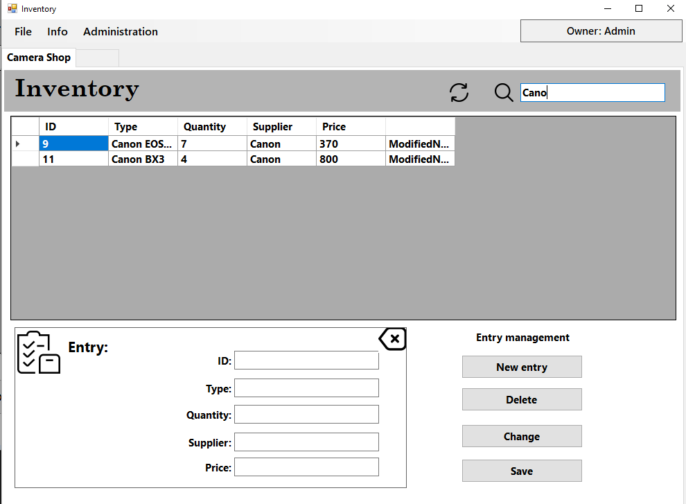

# Inventory Management System

This project is an Inventory Management System built with C# .NET Windows Forms and Microsoft SQL Server Express. The Inventory Management System is an application designed to streamline the management of inventory items within an organization. This system provides features for user authentication, inventory tracking, and administrative control, making it an ideal solution for businesses that require efficient and secure inventory management. It can be used in retail, warehousing, manufacturing, and other industries where inventory tracking is required.


## Features

### User Authentication
- **Login Form**: Allows users to log in with a username and password. The password is securely hashed using the MD5 algorithm before being validated against the database.


[Login Form code](https://github.com/NathKoch/Inventory_Management_System/blob/main/Inventory_Management_System/Inventory_Management_System/Log_in.cs)

- **Sign-Up Form**: New users can create accounts by entering a unique username and password. The system checks if the username is already taken and stores the hashed password in the database.
- **Password Visibility Toggle**: Users can toggle the visibility of their passwords while typing on both the login and sign-up forms.


[Sign Up Form code](https://github.com/NathKoch/Inventory_Management_System/blob/main/Inventory_Management_System/Inventory_Management_System/Sign_up.cs)

### Inventory Management
-  **Full CRUD** (Create, Read, Update, Delete) operations with embedded SQL commands for inventory items, allowing users to add, view, modify, and delete inventory records.


[Inventory Form code](https://github.com/NathKoch/Inventory_Management_System/blob/main/Inventory_Management_System/Inventory_Management_System/Administration.cs)
- **Add Inventory Items**: Users can add new inventory items through a dedicated form. Details include type, quantity, supplier, and price of the item.
- **Edit Inventory Items**: Users can select an item from the data grid, modify the details, and save the changes.
- **Delete Inventory Items**: Admin users can delete inventory items, effectively removing them from the database.
- **Search Inventory Items**: Users can search for inventory items using a search bar that filters the data grid based on the input.
- **Refresh Inventory Data**: Users can refresh the inventory data displayed in the data grid to see the most recent changes.
- **Admin Permissions**: Admin users have additional permissions, including the ability to delete inventory items and access the administration menu.


[Add Form code](https://github.com/NathKoch/Inventory_Management_System/blob/main/Inventory_Management_System/Inventory_Management_System/Add.cs)
### Data Grid Management
- **Data Display**: Inventory items are displayed in a data grid with columns for ID, type, quantity, supplier, and price.
- **Row States**: The system tracks the state of each row in the data grid (e.g., existed, new, modified, deleted) to manage changes efficiently.
- **Data Update**: Changes made to inventory items are updated in the database upon saving, including additions, modifications, and deletions.
- **Clear Fields**: Users can clear input fields to reset the form for new entries or edits.



[Check Permission class code](https://github.com/NathKoch/Inventory_Management_System/blob/main/Inventory_Management_System/Inventory_Management_System/checkPermission.cs)

### Administration
- **Administration Menu**: Admin users can access an administration menu for managing user permissions and other administrative tasks.

- **View and Edit Users**: Admin users can view all users, modify user permissions, and delete user accounts.


[Administration Form code](https://github.com/NathKoch/Inventory_Management_System/blob/main/Inventory_Management_System/Inventory_Management_System/Administration.cs)

## Database Setup
1. Start the Microsoft SQL Server Express.
2. Create a new database named InventoryManagementSystemDB in Microsoft SQL Server.
3. To create a new database and tables run the following SQL script:
[SQL commands](https://github.com/NathKoch/Inventory_Management_System/blob/main/StartDatabase.sql "SQL commands for starting a new database and tables")
4. Enter the name of your server in the Data Source: [Database class code](https://github.com/NathKoch/Inventory_Management_System/blob/main/Inventory_Management_System/Inventory_Management_System/Database.cs)

## Usage

1. **Launch the Application**
   - Open the application by running the exe file or through Visual Studio.
   
2. **Sign Up**
   - If you do not have an account, click the "Sign Up" link.
   - Enter a unique username and password.
   - Click "Create" to register a new account.
   
3. **Log In**
   - Enter your username and password on the login form.
   - Click "Login" to access the inventory management system.
   
4. **Manage Inventory**
   - **View Inventory**: The main form displays a data grid with all inventory items.
   - **Add Item**: Click "New Entry" to open the add item form, fill in the details, and click "Save".
   - **Edit Item**: Select an item in the data grid, modify the details in the input fields, and click "Change".
   - **Delete Item**: Select an item in the data grid and click "Delete". (Admin only)
   - **Search Items**: Type in the search bar to filter items based on ID, type, quantity, supplier, or price.
   - **Refresh Data**: Click the refresh button to reload the inventory data from the database.
   
5. **Administration**
   - Admins can access additional functionalities through the administration menu, such as viewing and modifying user permissions.
   - **View Users**: See a list of all registered users.
   - **Edit Permissions**: Change user permissions (admin or user) and save changes.
   - **Delete User**: Remove a user account from the system.


## Installation

To get a local copy up and running, follow these simple steps:

1. Clone the repository
   ```sh
   git clone https://github.com/NathKoch/Inventory_Management_System.git
   ```
2. Open the project in Visual Studio.
3. Restore the NuGet packages.
4. Update the connection string in class Database in file Database.cs to match your SQL Server instance.

## Contributing

Contributions are what make the open-source community such an amazing place to learn, inspire, and create. Any contributions you make are **greatly appreciated**.

1. Fork the Project
2. Create your New Feature Branch (`git checkout -b feature/NewFeature`)
3. Commit your Changes (`git commit -m 'Add some New Feature'`)
4. Push to the Branch (`git push origin feature/NewFeature`)
5. Open a Pull Request

